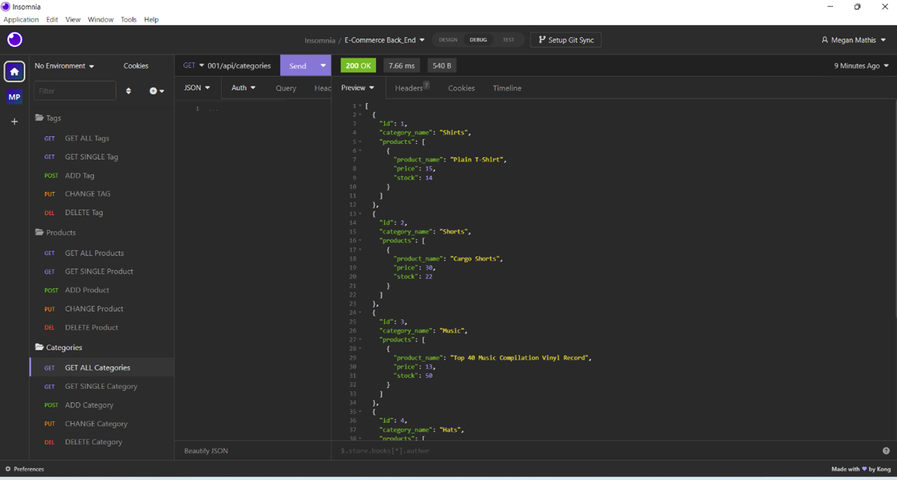
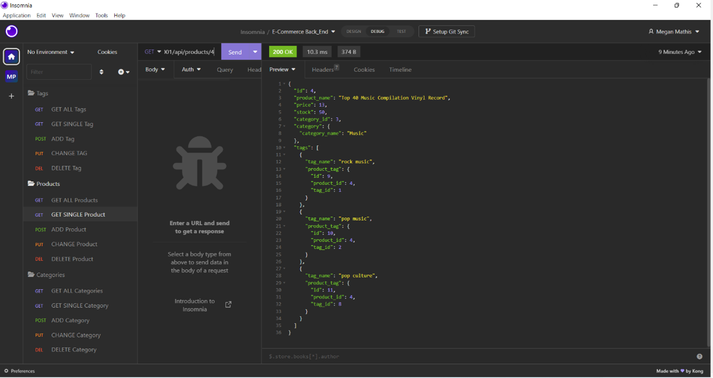
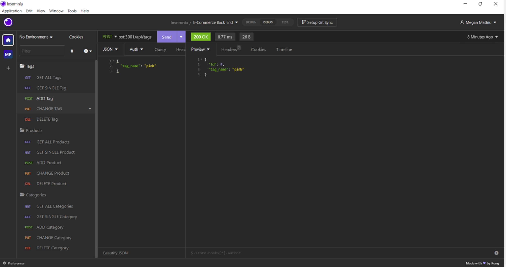
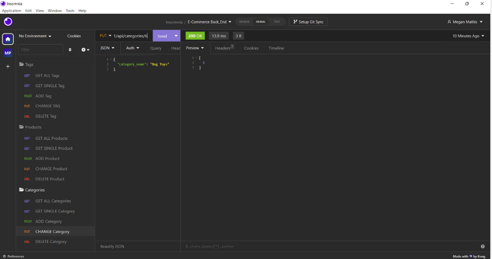
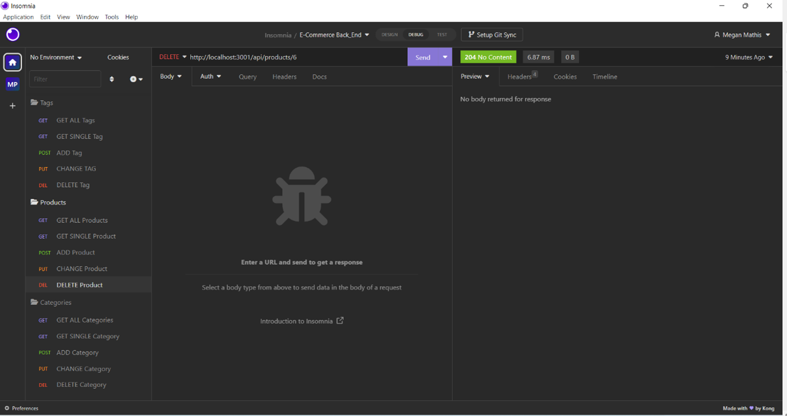

# E-Commerce Back End

## Description

This application is a backend e-commerce database. It uses Express.js, Sequelize, and MySQL.

When a user inputs their MySQL username and password, they are able to connect to the database using Sequelize. When invoking the schema and seed commands, the data base is created. Sequilize is synced with the MySQL database and the user can test with Insomnia the API GET, POST, PUT, and DELETE routes.

## Table of Contents

- [Installation](#installation)
- [License](#license)
- [Usage](#usage)
- [ScreenShots](#screenshots)
- [Video](#video)
- [Links to Deployment](#linkstodeployment)
- [Credits](#LinkstoDeployment)
- [Contribution](#contribution)
- [Tests](#tests)
- [Questions](#questions)

## Installation

1. Clone the repo
2. npm install
3. npm run seed
4. npm start
5. Go to Insomnia to test API routes

## License

MIT

## Usage

1. Go to Insomnia
2. Test GET all Categories, Products, and Tags
3. Test GET Single Category, Product, and Tag
4. Test POST Category, Product, and Tag
5. Test PUT Category, Product, and Tag
6. Test DELETE Category, Product, and Tag

## ScreenShots

## Video

https://drive.google.com/file/d/1s0Kf-njHHdzfHB4nn8uTy-5RvrZdjrhp/view?usp=sharing

## Links to Deployment

https://github.com/MegMathis/E-Commerce_Backend

## Credits

Ask BCS

https://sequelize.org/docs/v7/other-topics/other-data-types/

https://sequelize.org/docs/v6/core-concepts/model-basics/

https://sequelize.org/docs/v6/core-concepts/validations-and-constraints/

https://sequelize.org/docs/v6/core-concepts/assocs/

https://www.youtube.com/watch?v=HJGWu0cZUe8

https://sequelize.org/docs/v6/core-concepts/model-querying-basics/

https://sequelize.org/docs/v6/core-concepts/model-querying-finders/

https://stackoverflow.com/questions/38620682/difference-between-response-status-vs-response-sendstatus-in-express

## Contribution

Megan Mathis

## Tests

n/a

## Questions

Any questions, please contact me at:

- GitHub:
  [MegMathis](http://github.com/MegMathis)
- Email:
  [mcdonough.megan25@gmail.com](mailto:mcdonough.megan25@gmail.com)
